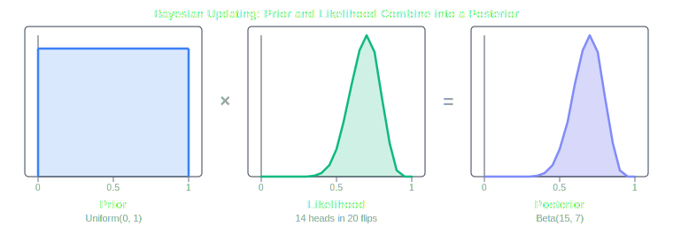
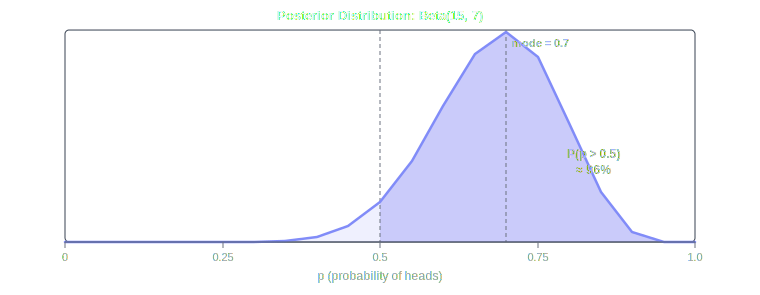

Suppose a doctor tells you that a test for a rare disease came back positive, and that the test is 99% accurate. Most people hear "99% accurate" and assume they almost certainly have the disease. But if the disease affects only 1 in 10,000 people, the chance you are actually sick given that positive result is less than 1%. The number that feels most relevant turns out to be nearly irrelevant without knowing how common the disease is in the first place.

This example cuts to the heart of a debate that has shaped statistics for well over a century. It is a debate not just about techniques, but about what probability itself means.

## What Is Probability?

This question sounds almost too basic to ask, but the answer is genuinely contested. There are two major schools of thought, and they give very different answers.

The **Frequentist** school says that probability is the long-run frequency of an event over many repeated trials. The probability of a fair coin landing heads is 0.5 because, if you flipped it an infinite number of times, exactly half would be heads. Probability, in this view, is a property of the world. It describes how often something happens.

The **Bayesian** school says that probability is a degree of belief. It is a number between 0 and 1 that represents how confident you are in a claim given the evidence you have. Probability, in this view, is a property of the mind. It describes what a rational agent should believe.

These two definitions agree on most of the underlying math, but they diverge sharply on what you are allowed to do with that math and, more importantly, what questions you are even allowed to ask.

## The Frequentist Approach

Frequentism grew out of a genuine desire to make statistics rigorous and objective. If probability is just a frequency, it can be measured. You run enough trials, count the outcomes, and there is your answer. No room for opinion.

The canonical tool of frequentist inference is **hypothesis testing**. The idea is to start with a default assumption called the **null hypothesis** and ask: how surprising would this data be if the null hypothesis were true?

This surprise is measured by the **p-value**: the probability of observing data at least as extreme as what you collected, assuming the null hypothesis holds. If the p-value falls below some threshold, usually 0.05, you reject the null hypothesis and call the result **statistically significant**.

A companion concept is the **confidence interval**. If you estimate a parameter, such as the average height of students at a university, a 95% confidence interval is a range constructed in such a way that 95% of intervals built this way, across many repeated experiments, would contain the true parameter.

This is a subtle distinction that trips people up constantly. A 95% confidence interval does not mean there is a 95% probability that the true value lies in this specific interval. Once you compute the interval, the true value either is or is not inside it. The probability statement describes the procedure, not the result in front of you. If you have ever described a confidence interval as "the range where the true value falls 95% of the time," you were actually describing something from the other camp.

## The Bayesian Approach

Bayesian statistics begins with a question that frequentism deliberately sidesteps: what did you believe before seeing the data?

This prior belief is encoded in a **prior distribution**, a probability distribution over all possible values a parameter could take. Once you observe data, you update it using **Bayes' theorem** to arrive at a **posterior distribution**, which reflects your updated beliefs.

The update rule is:

```
posterior ∝ likelihood × prior
```

The **likelihood** measures how probable the observed data is under each possible value of the parameter. Multiply it by the prior, renormalize, and you get the posterior: a complete distribution expressing your uncertainty after seeing the evidence.

**Figure 1:**



Where a frequentist gives you a point estimate and a confidence interval, a Bayesian gives you the full posterior. This is a genuinely different object. You can ask: what is the probability that the parameter exceeds some threshold? What is the most probable value? How wide is the uncertainty? All of these questions have direct, clean answers from the posterior.

The Bayesian analog of a confidence interval is a **credible interval**. A 95% credible interval means exactly what most people mistakenly think a confidence interval means: there is a 95% probability that the true parameter lies in this range, given the data and the prior. The statement applies to the specific interval you computed, not to the procedure that generated it.

## Back to the Doctor

The medical example from the opening is Bayesian reasoning made concrete. Let us work through it.

The disease affects 1 in 10,000 people, so the prior probability of having it before any testing is 0.0001. The test is 99% accurate: if you have the disease it returns positive 99% of the time, and if you do not it returns negative 99% of the time.

Plugging into Bayes' theorem:

```
P(disease | positive) = P(positive | disease) × P(disease) / P(positive)

P(positive) = P(positive | disease) × P(disease) + P(positive | no disease) × P(no disease)
            = 0.99 × 0.0001 + 0.01 × 0.9999
            ≈ 0.0001 + 0.01
            ≈ 0.0101

P(disease | positive) = (0.99 × 0.0001) / 0.0101 ≈ 0.0098
```

Just under 1%. The prior was so strongly against the disease that even a highly accurate positive result barely shifts the belief. This is not a flaw in the reasoning; it is the reasoning working correctly.

A frequentist analysis would not naturally produce this number. Frequentism asks: how often does the test return a correct result? The prior probability of having the disease is not a frequency you can condition on, because from the frequentist perspective, you either have the disease or you do not. There is no repeatable experiment to anchor a probability to.

## Where Frequentists Push Back

Bayesians sometimes make the updating procedure sound almost inevitable, but there is a real objection buried in the prior. Where does it come from?

In the medical example the prior was clean: a well-measured epidemiological prevalence rate. But suppose you want to estimate the effect of a new drug and you have no meaningful prior knowledge. A Bayesian must still choose a prior. Different researchers with different priors will arrive at different posteriors. To a frequentist, this feels like subjective opinion entering science through a side door that everyone agreed to close.

The entire frequentist project was to remove that kind of judgment from inference. Results should depend on the data, not on what someone happened to believe before the experiment.

Bayesians counter that priors often stop mattering once you have enough data, since a strong likelihood overwhelms any reasonable prior. They also argue that frequentists smuggle in their own judgment when they choose a significance threshold, decide on a sample size, or frame the null hypothesis. The subjectivity does not disappear; it just moves to a less obvious place.

This is where the two camps have been arguing for the better part of a century, and neither side has cleanly won.

## A Tale of Two Intervals

Here is a concrete example where the two approaches give you different things to look at.

You flip a coin 20 times and get 14 heads. You want to know whether the coin is fair.

A frequentist sets up a null hypothesis that the coin is fair (p = 0.5) and computes the p-value: the probability of getting 14 or more heads in 20 flips if the coin were actually fair. That probability works out to about 0.058. Since it is just above 0.05, a frequentist would not reject the null hypothesis at the standard threshold. Technically not significant.

A Bayesian computes the posterior distribution over p, the probability of heads, after observing 14 successes in 20 trials. Starting from a flat prior, the posterior is a Beta(15, 7) distribution. The full picture is right there in the curve.

**Figure 2:**



The two analyses are not contradictory. They answer different questions. The frequentist asks: is this data inconsistent enough with a fair coin to rule one out? The Bayesian asks: given what I observed, what should I believe about the coin? The posterior says the probability that this coin is biased toward heads is about 96%. That is a more direct answer to what most people actually want to know.

## When to Use Each

Neither camp has a monopoly on correctness. Their real strengths depend on what you need.

Frequentist methods tend to work well when:

- **You need objective, reproducible benchmarks.** Clinical trials and regulatory decisions lean on frequentist tests precisely because they minimize the influence of any individual researcher's priors.
- **You have plenty of data.** With large samples, the likelihood dominates any reasonable prior and the two approaches converge anyway.
- **The question is binary.** Hypothesis testing was built for yes-or-no decisions: reject or do not reject.

Bayesian methods tend to work well when:

- **You have genuine prior knowledge.** Throwing away real information in the name of objectivity is a choice with consequences. Bayesian methods make it possible to use what you already know.
- **You want to communicate uncertainty fully.** The posterior gives you the whole distribution, not just a point estimate and a threshold judgment.
- **You are updating over time.** Because the posterior from one experiment becomes the prior for the next, Bayesian reasoning is naturally suited to situations where evidence accumulates continuously.

## The Deeper Divide

Beneath the technical differences is a philosophical disagreement about the goal of statistics itself.

Frequentism insists that science should be anchored to things that can be repeatedly measured. Probability has to describe something out there in the world, not a state of mind. Bayesianism insists that science is fundamentally about updating beliefs in light of evidence, and that the state of your belief is not something to hide as long as you make it explicit and revise it consistently.

What I find most interesting about this debate is that it is not really settled by data. It is a question about what statistics is for. Both schools have produced enormous amounts of genuinely useful science, which is probably the strongest argument that neither one is simply wrong.

For most purposes, the practical lesson is simpler: understand what your tools are actually doing before you use them. A p-value and a posterior probability are not the same number dressed up differently. Treating them as if they are is how you end up confidently reporting results that mean something quite different from what you think.
