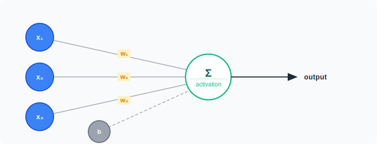
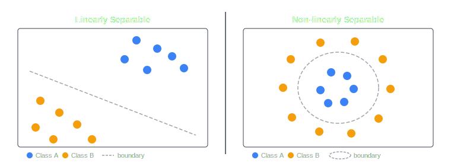
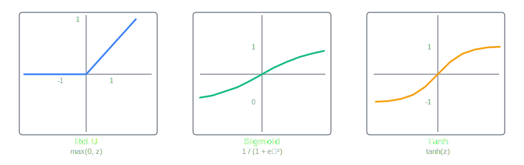
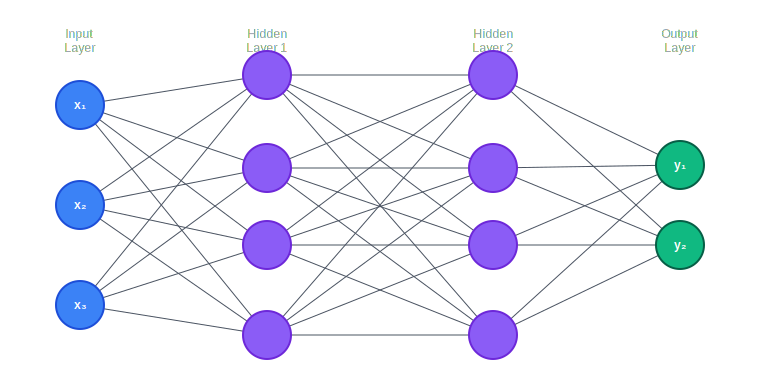
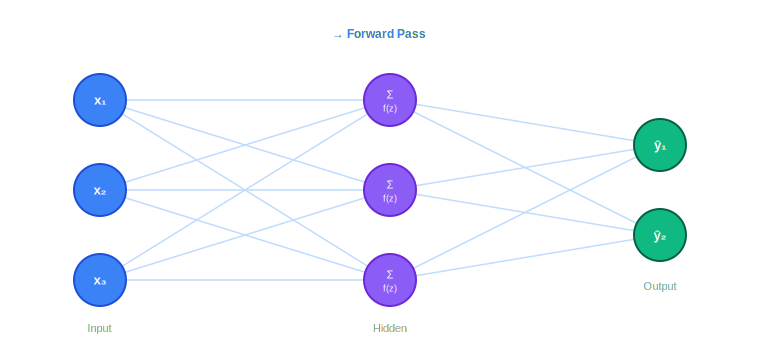
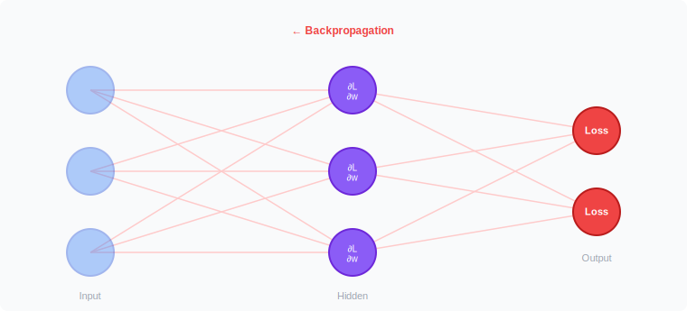
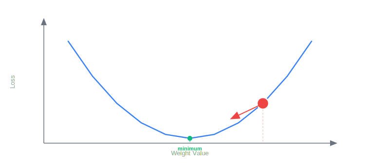

Neural networks sit at the core of nearly every major advancement in artificial intelligence over the last decade. The goal of this article is to build a complete and intuitive understanding of how they work from a single artificial neuron to the training process behind deep learning. We will start from the basics and work our way up step by step. A basic familiarity with vectors and derivatives will help, but the focus here is intuition, not formulas.

## Why Neural Networks?

Before we build anything, it is worth asking: why neural networks in the first place?

The world is full of problems that are easy for humans but hard to define with explicit rules. How would you write a rule that distinguishes a photo of a cat from a photo of a dog? How would you write a rule that maps a sentence in English to its correct French translation? Traditional programming asks you to specify the logic manually. Neural networks take the opposite approach: instead of writing the rules, we define a flexible mathematical structure and let it _learn_ the rules from data.

This idea turns out to be remarkably general. Neural networks form the backbone of:

- **Computer vision (CV) models** - classifying images, detecting objects, and generating new visuals.
- **Natural language processing** - translation, summarization, and language models.
- **Transformers** - the architecture behind GPT and BERT, which has redefined what is possible in AI.
- **Generative models** - systems that synthesize new data, from realistic images to music.

The thread connecting all of these is the same underlying structure: layers of interconnected artificial neurons. Let us start there.

## The Perceptron: One Artificial Neuron

### What is a Perceptron?

The perceptron is the simplest model of an artificial neuron and the fundamental building block of every neural network. The idea is loosely inspired by biology: a neuron receives signals, processes them, and decides whether to fire.

Mathematically, a perceptron takes a set of inputs, multiplies each by a corresponding **weight**, sums the results, adds a **bias**, and passes the total through an **activation function** to produce an output.

**Figure 1:**



The computation is:

```
z = w1*x1 + w2*x2 + ... + wn*xn + b
output = activation(z)
```

Let us break this down:

- **Inputs (x):** The raw data pixel values, sensor readings, word embeddings, etc.
- **Weights (w):** How much influence each input has. A high weight amplifies its input; a weight near zero ignores it. These are the values the network _learns_.
- **Bias (b):** A constant that shifts the output, giving the model more flexibility.
- **Activation function:** Applied to the weighted sum `z` to introduce non-linearity.

The weights and bias are the parameters the network adjusts during training. The activation function, however, is a design choice and it is a critical one.

### Why Non-Linearity Matters

This is a subtle but important point worth pausing on. Without an activation function, a perceptron is just a linear function of its inputs. And no matter how many linear functions you compose, you still get a linear function. Stacking ten linear perceptrons is mathematically equivalent to a single perceptron with different weights.

Take a moment to think about what that means. If the world were linear, this would be fine. But consider trying to draw a boundary between two classes of data like the example below.

**Figure 2:**



The left panel is a case where a straight line suffices. The right panel cannot be solved with any straight line the boundary must curve. The activation function introduces those curves, thresholds, and bends that allow the network to represent complex boundaries.

Some common choices include:

- **ReLU (Rectified Linear Unit):** Outputs `max(0, z)`. Negative inputs are zeroed out, positive inputs pass through. Extremely popular in practice.
- **Sigmoid:** Squashes output to a value between 0 and 1. Useful for the output layer in binary classification.
- **Tanh:** Similar to sigmoid but centered at zero, outputting values between -1 and 1.
- **Softmax:** Converts a vector of raw scores into a probability distribution summing to 1. Used in multi-class classification output layers.

**Figure 3:**



A single perceptron with a non-linear activation can already make simple decisions. The real power comes when we stack many of them.

## From One Neuron to a Full Network

### Layers and Hidden Nodes

A neural network organizes perceptrons into **layers**:

- **Input layer:** Receives the raw data. Each node corresponds to one feature of the input.
- **Hidden layers:** The intermediate layers between input and output. This is where most of the learning happens. A network with many hidden layers is called a **deep** network.
- **Output layer:** Produces the final result: a class label, a numerical value, or a probability distribution depending on the task.

**Figure 4:**



Notice that every node in one layer connects to every node in the next. We call this a **fully connected** or **dense** layer. The number of layers and the number of nodes per layer are **hyperparameters** design choices made before training begins, not values the network learns on its own.

### Forward Propagation

Once the network is assembled, data moves through it in a process called **forward propagation**. Starting from the input layer, each neuron computes its weighted sum, applies its activation function, and passes the result to the next layer. This continues until we reach the output.

**Figure 5:**



At the end of a forward pass, we have a prediction. Now the question is: how wrong was it, and how do we correct it?

## Training: How a Network Learns

### The Loss Function

After a forward pass, we need a way to measure error. This is the role of the **loss function**. It takes the network's prediction and the true answer, and returns a single number representing how wrong the prediction was lower is better.

Common choices include:

- **Mean Squared Error (MSE):** Measures the average squared difference between predicted and actual values. Common in regression.
- **Cross-Entropy Loss:** Penalizes confident wrong predictions more severely. Standard for classification.

The entire goal of training is to minimize the loss.

### Hyperparameters

Before training begins, we must make several design choices that the network itself does not learn:

- **Number of layers and hidden nodes per layer:** More capacity allows the network to represent more complex patterns, but also risks memorizing the training data rather than generalizing.
- **Learning rate:** Controls how large a step we take when updating weights. Too large and training becomes unstable; too small and it is painfully slow.
- **Batch size:** How many training examples to process before updating the weights.
- **Number of epochs:** How many full passes through the training data.

### Weight Initialization

Before training begins, we must also assign initial values to the weights. This might seem like a minor detail, but it is not.

If all weights are initialized to the same value say, zero every neuron in a layer computes identical outputs and receives identical gradient updates. The network loses the ability to differentiate its neurons and effectively behaves as a single one. This is called **symmetry breaking failure**.

The other risk is scale. If the initial weights are too large, the weighted sums `z` become very large, pushing activations into regions where gradients are nearly zero. The gradient then essentially vanishes as it travels backward through the network this is the **vanishing gradient problem**. The reverse can also happen: gradients can grow exponentially as they flow backward, causing **exploding gradients** and making training unstable.

Good initialization keeps activations and gradients in a manageable range. Two common strategies are:

- **Xavier / Glorot initialization:** Scales weights based on the number of input and output connections at each layer. Works well with Sigmoid and Tanh activations.
- **He initialization:** A variant of Xavier designed for ReLU, accounting for the fact that roughly half of all inputs are zeroed out.

### Backpropagation and Gradient Descent

We now have a prediction, a loss, and well-initialized weights. The remaining question is: which weights contributed to the error, and in what direction should we adjust them?

This is the job of **backpropagation**. Using the **chain rule** from calculus, backpropagation works backward from the loss through each layer, computing the **gradient** of the loss with respect to every weight in the network. You do not need to work through the calculus to develop the right intuition. Think of it this way:

> Backpropagation tells each weight: "here is how much you contributed to the error, and here is which direction to move to reduce it."

**Figure 6:**



Once we have the gradients, we update the weights using **gradient descent**:

```
new_weight = old_weight - learning_rate * gradient
```

We subtract because we want to move in the direction that reduces the loss. Figure 7 visualizes this on a simplified loss landscape, where the ball represents the current weight value rolling toward the minimum.

**Figure 7:**



In practice, we do not compute the gradient over the entire dataset at once. Instead we use **mini-batch gradient descent**, processing a small random subset of training examples at a time before updating the weights. This introduces some noise, but that noise can help the network escape poor solutions.

This full cycle: forward pass, compute loss, backpropagate gradients, update weights, repeats for many iterations until the loss converges.

## Different Types of Neural Networks

Understanding the feedforward network we built gives you the tools to reason about more specialized architectures. Here is a brief tour.

### Convolutional Neural Networks (CNNs)

Designed for grid-structured data like images. Instead of connecting every input to every neuron, convolutional layers apply small learnable filters that slide across the input and detect local patterns; edges, textures, shapes. Deeper layers detect increasingly abstract features. CNNs are the dominant architecture in computer vision.

### Recurrent Neural Networks (RNNs)

Designed for sequential data like text or time series. Unlike feedforward networks, RNNs have connections that loop back, the output from one step is fed in as input to the next, giving the network a form of memory. RNNs struggle with long sequences due to vanishing gradients, which led to more sophisticated variants like LSTMs and GRUs.

### Transformers

The architecture that reshaped natural language processing, and increasingly vision as well. Rather than processing data sequentially, transformers process the entire sequence at once using a mechanism called **self-attention**, which allows every part of the input to relate to every other part simultaneously. This makes them highly parallelizable and capable of capturing long-range patterns. Models like GPT and BERT are built on this architecture. A full treatment of transformers warrants its own article.

### Generative Models

Networks designed not just to classify, but to _create_. **Generative Adversarial Networks (GANs)** pit a generator against a discriminator in a competitive training loop, pushing both to improve until the generator produces realistic data. **Diffusion models**, which power tools like Stable Diffusion, learn to reverse a gradual noise-addition process, eventually generating high-quality outputs from pure noise. These too deserve a separate deep dive.

---

The simple feedforward network we built in this article is the foundation for all of the above. Each architecture takes that foundation and modifies it to exploit structure in a particular type of data. Once you understand how weights are learned through forward propagation, backpropagation, and gradient descent, the next natural question is: what assumptions can we bake into the structure of the network to make learning more efficient? This train of thought is what helped develop such architectures.
