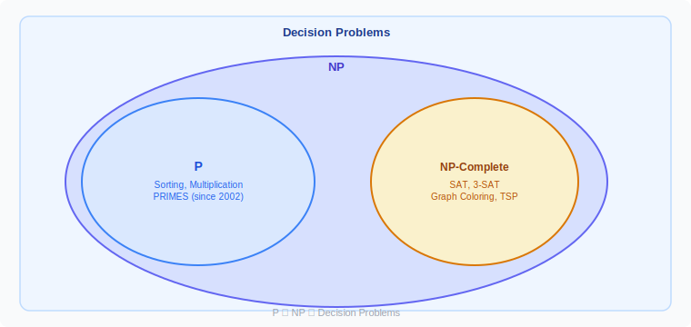
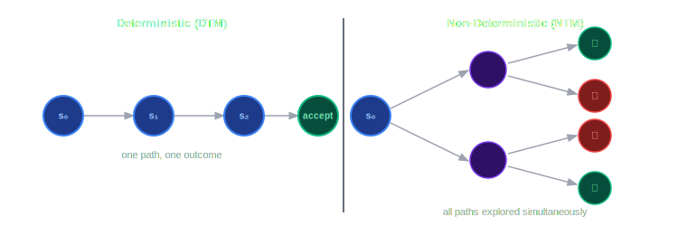

Out of all the [millennium problems](https://www.claymath.org/millennium-problems/), P vs NP is probably the one that I understand the most. This is also why CS students sometimes encounter it in their undergraduate complexity theory courses, just like I have. What makes this a million dollar question however is the difficulty in being able to prove it rigorously.

In this text I want to provide you with a simplified explanation of the P vs NP problem — for both curious readers and my future self that might forget this problem.

## Background

When we look at problems in math, we usually think about having a question with inputs and "solving" it to provide an output. While the same exists in complexity theory, we will only be focusing on those problems that make a Yes or No decision, also known as **decision problems**.

For example, a multiplication decision problem: Is 5 × 6 = 23? The answer is no. The inputs here are `{5, 6, 23}` and the output is `No`. We can essentially convert any normal math problem into a decision problem by simply including the answer variable as part of the input.

In the early years of CS, computer scientists thought about separating problems into classes based on a variety of things. A trivial example is decision problems versus non-decision problems. Within the class of decision problems, we have the **Polynomial Time (P)** class and the **Non-deterministic Polynomial Time (NP)** class.

**Figure 1:**

## Terminology

Rigorously speaking:

- **Polynomial Time (P):** The class of decision problems solvable by a deterministic Turing machine in `O(nᵏ)` time.
- **Non-deterministic Polynomial Time (NP):** The class of decision problems solvable by a non-deterministic Turing machine in polynomial time.

While [Turing machines](https://en.wikipedia.org/wiki/Turing_machine) deserve their own page to explain with the exact nuances, below is a concise and sufficient explanation:

> A **Deterministic Turing Machine (DTM)** follows a single, predetermined path for any input, where each step leads to exactly one next step. A **Non-Deterministic Turing Machine (NTM)** can branch into multiple possible next steps simultaneously, exploring many paths at once. Essentially, a DTM is like following a map, while an NTM can try all paths at the same time to find an answer.

**Figure 2:**

Coming back to P and NP, an easy way to think about it is: if a problem can be **solved** in polynomial time it is in P, and if a problem can be **verified** in polynomial time it is in NP.

## The Million Dollar Question

The million dollar question is to create a strict proof to either prove or disprove that every problem that exists in NP also exists in P.

Here are some things we know:

**1. P ⊆ NP**

Any problem that exists in P trivially also exists in NP. This is because we can always use the algorithm in P to help us verify whether a provided answer is correct. For example:

> Given `a`, `b`, `c` — is `a × b = c`?

This problem is in P because using simple multiplication we can determine in `O(n²)` time whether `a × b = c`. It is also in NP because we can verify the answer using that same solution. Keep in mind that even if we needed something extra to verify it, it would still be NP.

**2. Being in NP does not mean a problem is not also in P**

If we know a problem is in NP, that alone does not mean we will never find a polynomial-time solution for it. A well known example is **primality testing**, also known as the `PRIMES` problem. For a long time computer scientists were not able to prove or disprove that `PRIMES` — which is in NP — is also in P. However in 2002, a group of researchers discovered [an algorithm that solves it in polynomial time](https://www.cse.iitk.ac.in/users/manindra/algebra/primality_v6.pdf), placing `PRIMES` firmly in P.

**3. NP-Complete problems are the hardest problems in NP**

There is a class of problems called **NP-Complete**, which is a subset of NP. It is rigorously proven that NP-Complete problems are the hardest problems in the NP class, and that proving any single NP-Complete problem is also in P would immediately prove that P = NP. However, it is generally believed that NP ≠ P, which means the real challenge is proving that NP ≠ P — something nobody has managed to do.

The P vs NP problem has three key barriers to resolution: **Relativization**, **Natural Proofs**, and **Algebrization**. These barriers block the techniques that mathematicians and computer scientists have historically used to resolve similar proofs. A successful proof, if it even exists, will almost certainly require discovering an entirely new approach. Either way, one thing is certain: if you are the first to solve it in the known world, you will certainly and literally win a million dollars.
